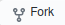

# Portafolio 🌼

__Hola! Esta es mi página de presentación personal donde expongo mis conocimientos y algunos de mis proyectos realizados.__

__Podés verlo haciendo click [acá](https://melicantamutto.github.io/portafolio/)__

***

## Instalación 🔧

Para clonar este repositorio tenés que:

- Ir la [página](https://github.com/melicantamutto/portafolio)

- Hacer click en 

- Hacer click en el botónde code y copiar la url

- Y luego en tu terminal de git (en la carpeta deseada) escribir

   ` git clone <url>`

- Entrar en la carpeta del proyecto y abrirlo en tu IDE

_Este proyecto no necesita la instalación de ninguna dependencia (por ahora)_

### Así se debería ver el proyecto

***

## Construido con ⌨️

- HTML5
- CSS3

   _(por el momento)_

***

## Expresiones de Gratitud 💕

- Principalmente a mi profe [Jonh](https://github.com/Jonhks), a [Leydy](https://github.com/leydyk93) y a las chicas de la sexta generación de Frontend online de [Ada](https://adaitw.org/) 🧚🏻‍♀️ y a su apoyo todos los días.
- A Ariel ❤️ y a mi familia que probaron la página 10.000 veces hasta que quedó.
- Si te gustó mi portafolio y lo queres compartir, te agradeciría muchisimo.

